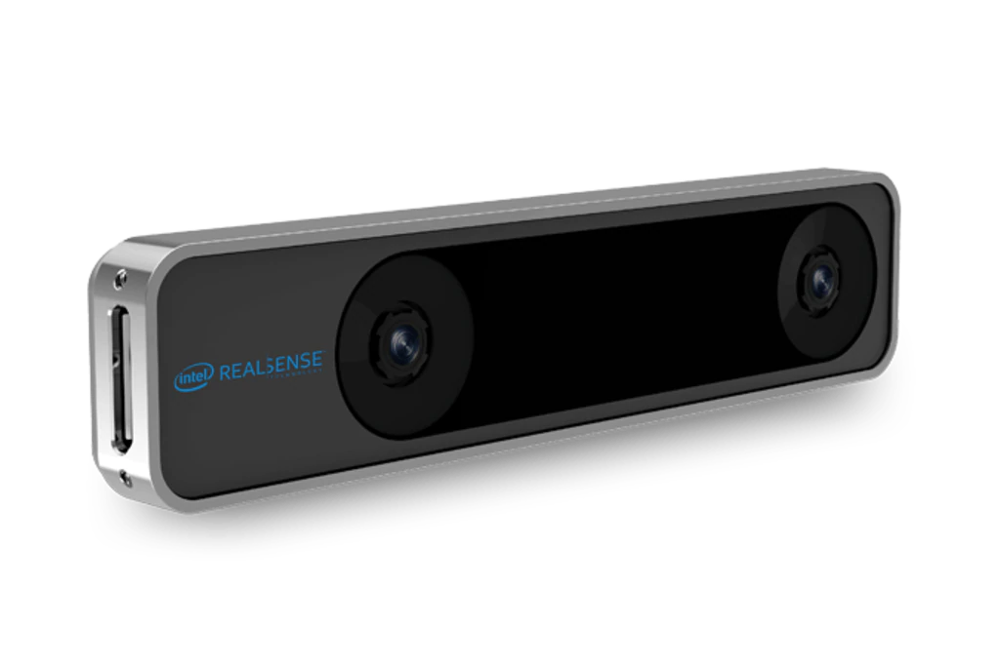
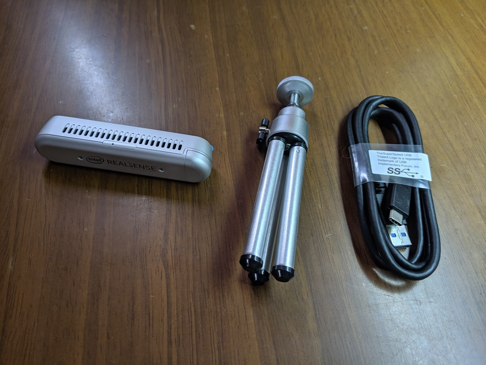

# D415を使ってみた

D415を用いた3Dスキャン

---

## D415とは

Intel RealSense Depth Camera D400シリーズの一種

デプスカメラ

---

## D400シリーズは3種類ある

D415、D435、D435i

---

### それぞれの違い

|  |D415  |D435  |D435i  |
|:---:|:---:|:---:|:---:|
|FoV  |65°  |85°  |85°  |
|シャッタータイプ  |ローリング  |グローバル  |グローバル  |
|モジュール  |Intel RealSense D415 module  |Intel RealSense D430 module  |Intel RealSense D430 module  |
|Imager  |2メガピクセル  |1メガピクセル  |1メガピクセル  |

---

### それぞれの違い

D415は精度が高いため、3Dスキャンに向いている

D435は視野が広いため、トラッキングに向いている

D435iはD435にIMU(深度データと同期して装置そのものの動きが測定できる)が搭載されている

今回は3Dスキャンをするため、D415を選択

---

T265というカメラも存在する

より高精度でトラッキングしたい時用

デプスカメラではない

---

## 購入

[Amazon](https://www.amazon.co.jp/gp/product/B07BJ1KKTV/ref=ppx_yo_dt_b_asin_title_o00_s00?ie=UTF8&psc=1)で購入

22,670円(2019年6月7日)

お急ぎ便で1日で届いた

---

## 同梱物

D415

三脚

USB3.1 C to A

---

# 参考文献

[インテル® RealSense™ テクノロジー](https://www.intel.co.jp/content/www/jp/ja/architecture-and-technology/realsense-overview.html)

[スイッチサイエンス](https://www.switch-science.com/)

[【記事】RealSense D415とD435 および D435iとT265の比較と選び方｜新着情報｜テガラ株式会社](https://www.tegara.com/news/2019/04/realsense-compare.html)
